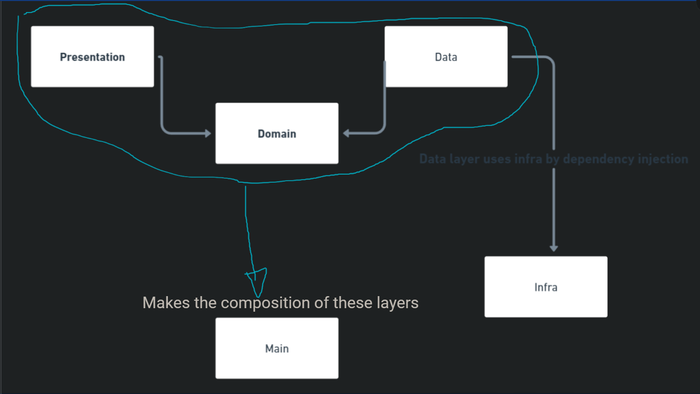

# NOT COMPLETED YET !!

# Simple social media API using Clean Architecture

## User history
[ ] - It's possible to register an user with name, email and password.
  [ ] - My password must have a maximum of 8 alphanumeric characters.
  [ ] - My email must be valid.
[ ] - I can log in the application with my email and password.
[ ] - I can add another user as friend.

## How to run
1° Install `Nodejs`

Then:
- `npm i`
- `npm run start`

## Domain
- Business rules with usecases and entities.

## Data layer
- Implementing the usecases from domain.

## Presentation
- Making the controllers following the usecases from domain and using the data layer by dependency injection at the time of instantiate the controller classes. Adapting the domain to the technology.

### Infra
- Used to create the repositories from repository pattern, but it don't have any relation with clean architecture even that is an interesting combination.

### Main
- Used as "dirty layer / corruption layer" out of clean architecture, just to compose all the layers and "instantiate" the application. As suggested by Uncle Bob.

## About this API
