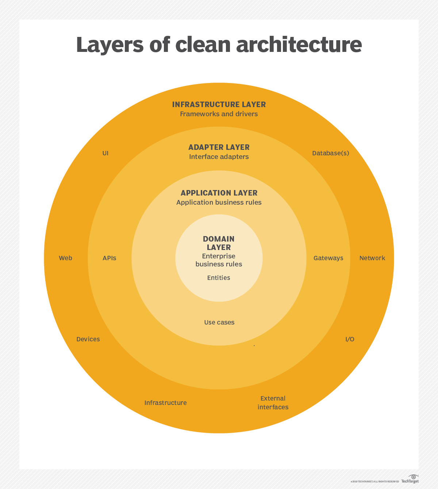

# Clean architecture
`“The only way to go fast, is to go well.” — Robert C. Martin`

## - Who created it and where is it documented ?
- Robert C. Martin, in the book: Clean Architecture: A Craftsman's Guide to Software Structure and Design.

## - How it was created ?
- Robert was creating an project and he wanted to focus on the business rules but defering to the future the technologies decisions. Such as: database, web framework, etc...

## - What's it ?
- A way to developing and organizing code in *layers*, better than we usually do without any specific method/architecture.
- When we say in `layers` is important to highlight that our business rules won't know about external agents.

## - Why is interesting to use an "Layered Architecture" ?
- Code more maintainable, organized and easier to add new features.
- Easier to test: We can test the business rules separated of the database and other things.
- Easier to change database or frameworks: mongodb by postgres or express by restify, etc...

## - What's the purpose of clean architecture ?
- Separate the business rules of the delivery mecanisms.

## - What's the downside, if it exists ?
- Initially would be harder than make a bad code, and it probably will spends more time too.
- But we know that good architectures are always worth.

`“If you think good architecture is expensive, try bad architecture.” — Brian Foote and Joseph Yoder`

## - What are these `4 Layers` in Clean architecture ?

## - Domain Layer
- The `business rule`, the `application core`, the `application "soul"`. If we change any thing here we probably will change "all that matters".
- This part don't know about any other layer, it don't know the database, the web framework used in the project, etc...

### > Entities ( the domain core )
- There is our `business objects`.
- There is not a layer because it has not dependencies, this don't know about nothing of all code base.

## - Application Layer

### > Use cases
- There are all application behaviors. Success and error responses.
- Where we implement the functionalities by user's history, with business rules.
- Into an use case it's possible to handle with one or more entities and one or more adaptors if necessary.

## - Adapter layer

### > Interface adapters
- Intermediate communication services, used to convert data, validate data and threat application errors. Such as: "invalid date", field of type number receiving string, etc...
- Communicate between external technologies and use cases.
- We can't use any business logic here, it is just to translate the usecase to the "framework" or "language".

## - Infraestructure layer

### Frameworks and drivers
- Particular technologies decisions, such as web frameworks or database models, etc...
- These details should be abstracted from the domain layer in a way that we don't need to spend a lot of time changing a framework or database model.

## - Tips to develop a "Clean Architecture"
- We think in the dependencies coming outside to inside, so the core layers don't know nothing about other layers.
- Abstract all you need, the infraestructure layer just contain implementation details reusing the abstractions.
- Use SOLID to create your clean architecture.
- Use depedency injection.

## Presentation Link ( in portuguese ):
- https://docs.google.com/presentation/d/e/2PACX-1vT0Dt4qRYXGx3DOyBzqmuL61kseUTiwA4O8PMU2U321ZoRNcQKRhC3v1GxmXpcqGpqR0Vzh6v5KOZ2o/pub?start=false&loop=false&delayms=60000
